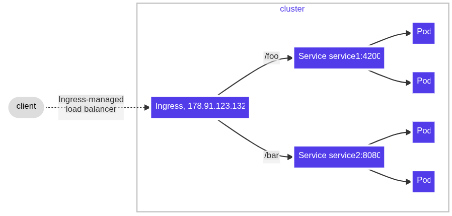
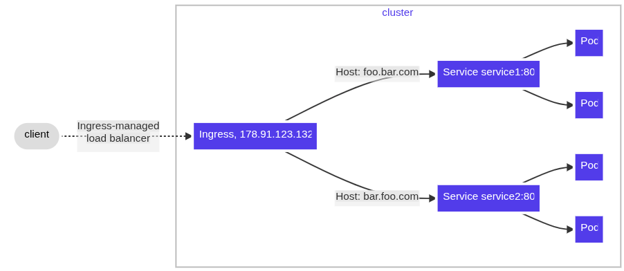

# 🌟 Ingress
## O que é?
O Ingress é um recurso (objeto) do Kubernetes que define regras de roteamento HTTP/HTTPS para expor serviços internos do cluster para o mundo externo. Ele atua como uma espécie de "roteador de tráfego" de aplicações.

> O **Ingress** atua como um ponto central de entrada para o cluster na forma de REVERSE PROXY HTTP, HTTP(s), e/ou também como um Gateway API para algum componente dentro do Kubernetes (normalmente para um Service).

## Principais características:

- Especifica hosts (por exemplo, app1.example.com) e caminhos (/, /api, etc.);
- Expôr serviços internos do cluster (como ClusterIP) para fora
- Permite configurar TLS (HTTPS);
- É declarativo: você descreve como quer que o tráfego seja roteado, e o IngressController implementa essas regras;
- Ter um ponto de entrada centralizado para o tráfego externo;
- Não faz nada sozinho! Depende de um IngressController que entenda e aplique essas regras.

## Principais componentes:
- **Ingress**: Podemos dizer que é a configuração que o IngressController deve assumir.
- **IngressController**: É o componente instalado no cluster kuberntes que fará o papel de Reverse Proxy HTTP e ApiGateway.
- **IngressClassName**: É o componente que diz qual IngressController será utilizado, pois, é possível ter instalado vários IngressController. 
> Resumindo... Nas definições do Ingress, é informado qual IngressClassName será utilizado, indicando em qual IngresController deve-se aplicar as configurações de rotamento do Ingress.


## Principais partes de um Ingress:

- **ingressClassName**: Define qual ingress className será utilizado
- **rules**: Define como rotear tráfego para serviços internos.
- **tls**: Define certificados TLS para HTTPS.
- **defaultBackend (opcional)**: backend padrão para requisições que não casam com nenhuma regra.

**Exemplo de Ingress**
```yaml
apiVersion: networking.k8s.io/v1
kind: Ingress
metadata:
  name: example-ingress
spec:
  ingressClassName: nginx
  defaultBackend:
    service:
      name: default-service
      port:
        number: 80
  tls:
    - hosts:
        - secure.local
      secretName: tls-secret
  rules:
  - host: app.example.com
    http:
      paths:
      - path: /
        pathType: Prefix
        backend:
          service:
            name: app-service
            port:
              number: 80

```
No exemplo acima, o ingress compreende requisições HTTP com destino ao domínio **app.example.com**, e transfere todas as requisições para o service **app-service** na port 80. O service por sua vez irá fazer o papel de LoadBalance para os PODs vinculado a ele.

# IngressController
## O que é?
O IngressController é o componente que escuta e processa recursos Ingress no cluster e cria rotas reais para o tráfego. Ele é responsável por implementar as regras que você descreveu nos Ingress.

## Principais características:

- Funciona como um reverse proxy / balanceador de carga de camada 7 (L7: HTTP/HTTPS).
- Cada IngressController tem seu conjunto de regras, que podem ser filtradas por IngressClass.
- Implementações populares:

    - Nginx (Ingress-Nginx Controller)
    - HAProxy
    - Traefik
    - Contoladores de nuvem (ex: AWS ALB Ingress Controller)

## Como funciona?
- Você cria um recurso **Ingress** com as regras de roteamento.
- O IngressController “vigia” esses recursos.
- Ele converte as regras em configurações reais (nginx.conf, haproxy.cfg, etc.).
- Ele gerencia a TLS termination (HTTPS) e balanceamento.

## Exemplo:
Quando você instala o nginx-ingress-controller via Helm ou manifest YAML, ele cria pods que monitoram todos os Ingress e aplicam as regras.

## Aplicando um IngressController Ngix no kind

### 1️⃣ Criação do cluster kind com mapeamento de portas


```bash
cat <<EOF | kind create cluster --config=-
kind: Cluster
apiVersion: kind.x-k8s.io/v1alpha4
nodes:
- role: control-plane
  extraPortMappings:
  - containerPort: 80
    hostPort: 7080
    protocol: TCP
  - containerPort: 443
    hostPort: 7443
    protocol: TCP
EOF
```

No exemplo acima, criamos o cluster com apenas 1 nó, mapeando as portas do host 7080 e 7443 para dentro do cluster nas portas 80 e 443.

### 2️⃣ Instalar o NGINX Ingress Controller no kind
Usaremos o **nginx** como componente do nosso controle do Ingress:
> Obs. O `nginx` é o ingressController mais utilizado no mercado.
```bash
kubectl apply -f https://kind.sigs.k8s.io/examples/ingress/deploy-ingress-nginx.yaml

```
Esse arquivo .yaml que aplicamos no cluster, instalou diversos componentes no namespace `ingress-nginx`.
```bash
kubectl get all --namespace ingress-nginx
```
Na parte do IngressController, normalmente apenas precisamos instalá-lo no cluster. Lembre-se, as regras de roteamento e api e reverse proxy são realizadas no componente "Ingress", na qual indicamos qual IngressController será aplicado as configurações.

Espere até que o POD do ingress-controller esteja no estado de `Running` para continuar...
```bash
kubectl -n ingress-nginx get pods
```

# IngressClass
## O que é?
O IngressClass é um recurso que define qual IngressController vai gerenciar determinado Ingress. Ele permite que múltiplos IngressControllers coexistam no cluster, cada um responsável por um conjunto de Ingresses.

## Características principais:

- Possui um controller: identificador do controlador que deve gerenciar Ingresses dessa classe.
- É referenciado no Ingress via .spec.ingressClassName.
- Facilita ambientes híbridos onde diferentes tipos de tráfego ou controladores são usados.

## Por que usar IngressClass?
Imagine que você quer:

- Um nginx IngressController para aplicações internas.
- Um Traefik IngressController para aplicações expostas publicamente.

Usando IngressClass, você isola qual IngressController gerencia cada Ingress.

**Configuração do IngressClass**

```yaml
apiVersion: networking.k8s.io/v1
kind: IngressClass
metadata:
  name: nginx
spec:
  controller: k8s.io/ingress-nginx
```
No caso de existir vários IngressClass, e desejar-mos tornar um deles como padrão , utilize a anotação `annotations:
    ingressclass.kubernetes.io/is-default-class: "true"`

O exemplo anterior ficaria assim:

```yaml
apiVersion: networking.k8s.io/v1
kind: IngressClass
metadata:
  name: nginx
  annotations:
    ingressclass.kubernetes.io/is-default-class: "true"
spec:
  controller: k8s.io/ingress-nginx
```

>Obs. Não precisamos criar os exemplos acima, quando instalamos o IngressControler do Ngnix o kind, já foi criado o IngressClass automaticamente.

```bash
kubectl get ingressclasses.networking.k8s.io
```
Este é um tipo de componente que não é "armazenado" dentro de um namespace: `kubectl api-resources --namespaced=false |  grep ingress`

# Exemplos de tipos de Ingress
Obs. Todos os exemplos a seguir, utilizará nosso IngressClassName **nginx**

Crie também o deployment e service a seguir
```bash
kubectl create deployment app01 --image=nginx --replicas=3

kubectl expose deployment app01 --port=80 --target-port=80
```

## 🔹 1. defaultBackend
Utilizando quando precisamos expor apenas 1 único service, sem a necessidade de aplicar regras.

Exemplo:

```yaml
apiVersion: networking.k8s.io/v1
kind: Ingress
metadata:
  name: default-backend
spec:
  ingressClassName: nginx
  defaultBackend:
    service:
      name: app01
      port:
        number: 80
```      
Limitação: Nem todos IngressControllers suportam o defaultBackend diretamente no Ingress

## 2. Simple Fanaut

Aqui o Ingress roteia de um único endereço IP para vários services baseado na URI requisitada.



```yaml
apiVersion: networking.k8s.io/v1
kind: Ingress
metadata:
  name: fanout-ingress
spec:
  ingressClassName: nginx
  rules:
    - host: fanout.local
      http:
        paths:
          - path: /app1
            pathType: Prefix
            backend:
              service:
                name: service1
                port:
                  number: 80
          - path: /app2
            pathType: Prefix
            backend:
              service:
                name: service2
                port:
                  number: 80
```

## 3. Name based virtual hosting 

Aqui, há um roteamento baseado no **header hosting** da requisição HTTP.



```yaml
apiVersion: networking.k8s.io/v1
kind: Ingress
metadata:
  name: name-virtual-host-ingress-no-third-host
spec:
  rules:
  - host: first.bar.com
    http:
      paths:
      - pathType: Prefix
        path: "/"
        backend:
          service:
            name: service1
            port:
              number: 80
  - host: second.bar.com
    http:
      paths:
      - pathType: Prefix
        path: "/"
        backend:
          service:
            name: service2
            port:
              number: 80
  - http:
      paths:
      - pathType: Prefix
        path: "/"
        backend:
          service:
            name: service3
            port:
              number: 80
```

No exemplo acima, observa-se que há 3 **rules**, se a requisição não tiver der match em **first.bar.com** e **second.bar.com**, os dados serão redirecionado para o **service3**.
